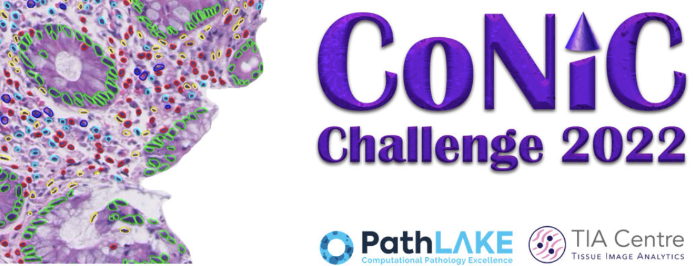

# Training HoVer-Net for CoNIC Challenge

This branch is dedicated to training the HoVer-Net for the [CoNIC challenge](https://conic-challenge.grand-challenge.org/). All parameters are hard-coded and are expected to work out of the box, as long as users follow the preparation steps mentioned below:

1. Setup environment as detailed in `requirements.txt`
2. Download the data from the [CoNIC challenge](https://conic-challenge.grand-challenge.org/)
3. Extract the data into the `exp_output/local/data` folder.
4. Run `python generate_split.py` to generate the a number
of training and validation subsets. For the baseline in the
challenge, we use the `FOLD_IDX=0`.
5. Run `python run.py --gpu 'GPU_DEVICES'` to start the training process. `GPU_DEVICES` should be replaced with the actual GPU ID on your own machine. For example, `GPU_DEVICES` equals `0,1` means using GPU 0 and GPU 1 for training.

## Hyper-parameters

The following files contain the hyper-paramters for training the HoVer-Net
- `models/hovernet/net_desc.py`: Define the HoVer-Net architecture. Unlike the original paper, we use the ResNet50 from pytorch as backbone and padded convolution in the decoders (resulting in the same output size as the input).
- `models/hovernet/opt.py`: Define the arguments for HoVer-Net training phases. If you want to modify the number of training epochs, modify it here. You can also find the weights for each loss component here.
- `dataloader/train_loader.py`: `FileLoader` defines how the
images are loaded and pre-processed (this include generating ground-truth from annotation). Compared with original version, we turn off all affine transformation (defined in
`__get_augmentation`).
- `param/template.yaml`: This file contains runtime parameters to input to the architecture or the running loop
(`batch_size`).

## Set Up Environment

```
conda env create -f environment.yml
conda activate hovernet
pip install torch==1.10.1+cu102 torchvision==0.11.2+cu102 torchaudio===0.10.1+cu102 -f https://download.pytorch.org/whl/cu102/torch_stable.html
```

Above, we install PyTorch version 1.10.1 with CUDA 10.2. 

## Citation

If any part of this code is used, please give appropriate citation to our HoVer-Net paper and our [CoNIC challenge](https://conic-challenge.grand-challenge.org/). <br />

BibTex entry: <br />
```
@article{graham2019hover,
  title={Hover-net: Simultaneous segmentation and classification of nuclei in multi-tissue histology images},
  author={Graham, Simon and Vu, Quoc Dang and Raza, Shan E Ahmed and Azam, Ayesha and Tsang, Yee Wah and Kwak, Jin Tae and Rajpoot, Nasir},
  journal={Medical Image Analysis},
  pages={101563},
  year={2019},
  publisher={Elsevier}
}

@article{graham2021conic,
  title={CoNIC: Colon Nuclei Identification and Counting Challenge 2022},
  author={Graham, Simon and Jahanifar, Mostafa and Vu, Quoc Dang and Hadjigeorghiou, Giorgos and Leech, Thomas and Snead, David and Raza, Shan E Ahmed and Minhas, Fayyaz and Rajpoot, Nasir},
  journal={arXiv preprint arXiv:2111.14485},
  year={2021}
}
```

## Authors

* [Quoc Dang Vu](https://github.com/vqdang)
* [Simon Graham](https://github.com/simongraham)
