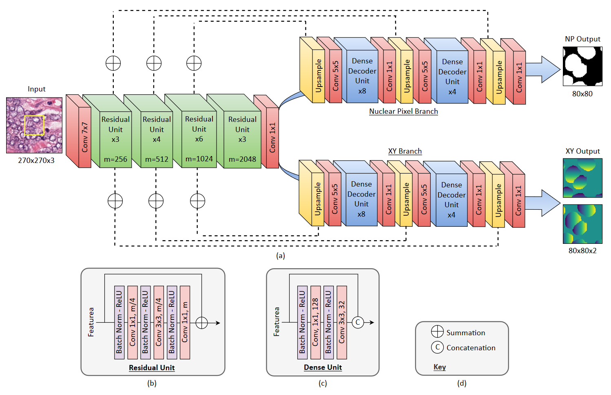

# XY Network for Nuclear Segmentation in Multi-Tissue Histology Images



A dual branch network, where one branch predicts the nuclear pixels while the other branch predicts the X and Y distance of each pixel to the nearest nuclear centroids.


# Repository Structure

* `src/` contains executable files used to run the model. Further information on running the code can be found in the relevant directory.
* `data/` refers to information on the data used within the paper

## Prerequisites 

Python 3.6 <br />
TensorFlow 1.8 <br />
Tensorpack  <br />
OpenCV 3.2

## Authors

* [Quoc Dang Vu](https://github.com/vqdang)
* [Simon Graham](https://github.com/simongraham)


## License

This project is licensed under the some License - see the [LICENSE.md](LICENSE.md) file for details

## Citation

```
@article{graham2018xy,
  title={XY Network for Nuclear Segmentation in Multi-Tissue Histology Images},
  author={Graham, Simon and Vu, Quoc Dang and Raza, Shan E Ahmed and Kwak, Jin Tae and Rajpoot, Nasir},
  journal={arXiv preprint arXiv:1812.06499},
  year={2018}
}
```

